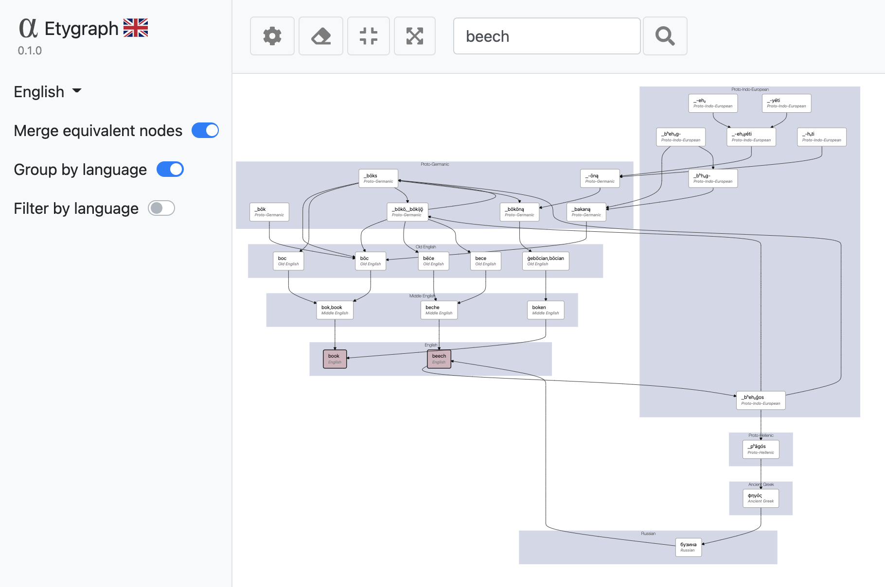

# etygraph

**‼️ Project Discontinuation Notice ‼️**

**This project, etygraph, is no longer functional and is considered unmaintained. The core data source it relied upon, `https://etytree-virtuoso.wmflabs.org/sparql`, is no longer available. As a result, the application cannot fetch etymological data.**

**Thank you to everyone who used or showed interest in etygraph.**

---

Discover the origin of the words. Try it in [https://etygraph.netlify.app](https://etygraph.netlify.app/)

## Languages
- English
- Spanish
- French
- Italian
- Portuguese
- Catalan
- Galician

## Screenshots

